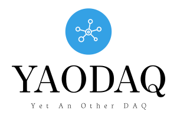

<h1 align='center'>
  <a id='logo' href='https://github.com/yaodaq/YAODAQ'></a>

  [](https://github.com/yaodaq/YAODAQ)
  [](https://github.com/yaodaq/YAODAQ)
  [](https://github.com/pre-commit/pre-commit)
  [](https://results.pre-commit.ci/latest/github/yaodaq/YAODAQ/main)
  [](https://github.com/yaodaq/YAODAQ/actions/workflows/pre-commit.yml)
  [](https://www.codacy.com/gh/yaodaq/YAODAQ/dashboard?utm_source=github.com&amp;utm_medium=referral&amp;utm_content=yaodaq/YAODAQ&amp;utm_campaign=Badge_Grade)

</h1>

## Documentation [](https://github.com/yaodaq/YAODAQ/actions/workflows/Docs.yml)

<h1 align="center">
  <a href="https://yaodaq.github.io/YAODAQ/">

  ```markdown
  🌍 Online
  ```

  </a>
  <a href="https://yaodaq.github.io/YAODAQ/YAODAQ_Manual.pdf">

  ```markdown
  📖 PDF
  ```

  </a>
</h1>

## Builds

|        | Linux Clang               | Linux GCC               | MacOS Clang               | MacOS GCC               | Windows M2sys               | Windows MSVC               |
|--------|---------------------------|-------------------------|---------------------------|-------------------------|-----------------------------|----------------------------|
| Github | [![Linux Clang][lcb]][lc] | [![Linux GCC][lgb]][lg] | [![MacOS Clang][mcb]][mc] | [![MacOS GCC][mgb]][mg] | [![Windows MSYS2][msb]][ms] | [![Windows MSVC][mmb]][mm] |

[lc]:https://github.com/yaodaq/YAODAQ/actions/workflows/Linux-Clang.yml
[lcb]:https://github.com/yaodaq/YAODAQ/actions/workflows/Linux-Clang.yml/badge.svg

[lg]:https://github.com/yaodaq/YAODAQ/actions/workflows/Linux-GCC.yml
[lgb]:https://github.com/yaodaq/YAODAQ/actions/workflows/Linux-GCC.yml/badge.svg

[mc]:https://github.com/yaodaq/YAODAQ/actions/workflows/MacOS-Clang.yml
[mcb]:https://github.com/yaodaq/YAODAQ/actions/workflows/MacOS-Clang.yml/badge.svg

[mg]:https://github.com/yaodaq/YAODAQ/actions/workflows/MacOS-GCC.yml
[mgb]:https://github.com/yaodaq/YAODAQ/actions/workflows/MacOS-GCC.yml/badge.svg

[ms]:https://github.com/yaodaq/YAODAQ/actions/workflows/Windows-MSYS2.yml
[msb]:https://github.com/yaodaq/YAODAQ/actions/workflows/Windows-MSYS2.yml/badge.svg

[mm]:https://github.com/yaodaq/YAODAQ/actions/workflows/Windows-MSVC.yml
[mmb]:https://github.com/yaodaq/YAODAQ/actions/workflows/Windows-MSVC.yml/badge.svg
